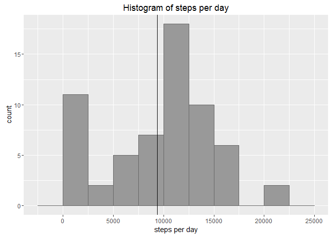
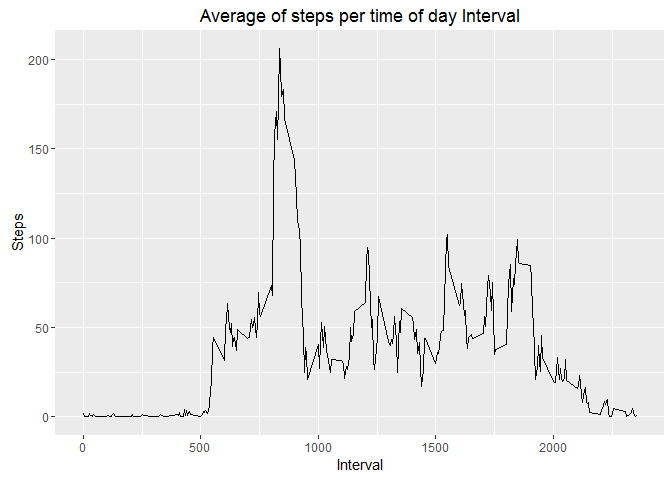
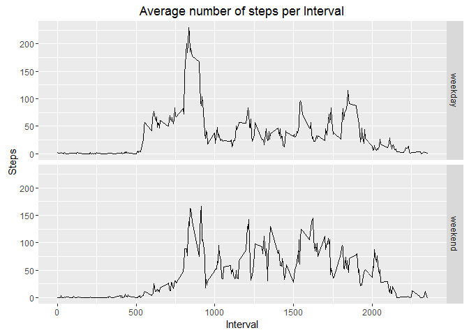

# Reproducible Research: Peer Assessment 1


## Loading and preprocessing the data

The original data comes in CSV file named `activity.csv` inside ZIP file named `activity.zip`. We read it and store in data frame.


```r
activityData <- read.csv(unz("activity.zip", "activity.csv"))
head(activityData)
```

```
##   steps       date interval
## 1    NA 2012-10-01        0
## 2    NA 2012-10-01        5
## 3    NA 2012-10-01       10
## 4    NA 2012-10-01       15
## 5    NA 2012-10-01       20
## 6    NA 2012-10-01       25
```

## What is mean total number of steps taken per day?

Aggregate all data by day, calulating the sum of steps per day ignoring the rows with missing values.


```r
# Aggregate and sum steps by day
stepsPerDay <- aggregate(list(Steps = activityData$steps), 
                         by=list(Date = activityData$date), 
                         FUN=function(x) { sum(x, na.rm=TRUE) })

# Draw histogram
library(ggplot2)
g <- ggplot(data=stepsPerDay, aes(stepsPerDay$Steps)) 
g <- g + ggtitle("Histogram of steps per day") + xlab("steps per day")
g <- g + geom_histogram(binwidth = 2500, fill=I("#999999"), col=I("#666666"))
g <- g + geom_vline(xintercept = mean(stepsPerDay$Steps))
g
```



Calculate mean and median total number of steps per day


```r
meanStepsPerDay <- round(mean(stepsPerDay$Steps))
medianStepsPerDay <- round(median(stepsPerDay$Steps))
```
**Mean** total number of steps per day: 9354

**Median** total number of steps per day: 1.0395\times 10^{4}

## What is the average daily activity pattern?

1. Aggregate all data by interval, calulating the average of steps for each interval across all days.
Missing steps values are ignored.


```r
# Aggregate by interval and calculate the average of steps
averagePerInterval <- function(data) {
    aggregate(list(Steps = data$steps), 
              by=list(Interval = data$interval), 
              FUN=function(x) { mean(x, na.rm=TRUE) })
}

stepsPerInterval <- averagePerInterval(activityData)

# Draw 
g <- ggplot(data = stepsPerInterval, aes(x = Interval, y = Steps))
g <- g + ggtitle("Average of steps per time of day Interval")
g <- g + geom_line()
g
```



2. Find the interval with maximum average number of steps across all days


```r
maxInterval <- stepsPerInterval$Interval[which.max(stepsPerInterval$Steps)]
```

The max interval is: 835.


## Imputing missing values


```r
# Get the number of rows with NA values
naRowCount <- sum(!complete.cases(activityData))
```

1. The total number of rows with missing values is: 2304.

2. For filling the missing value of number of steps taken in some interval we will use the average number of steps in that interval across all days. If there are no average value for that interval (all are NA), then we take it as 0.


```r
# The function below defines how we get missing value for number of steps in interval, given a row
# of original data which may have NA value of steps
getNumberOfSteps <- function(activityRow) {
    if (is.na(activityRow$steps)) {
        average <- stepsPerInterval$Steps[stepsPerInterval$Interval == activityRow$interval]
        if (is.na(average)) 0.0 else average
    } else {
        activityRow$steps
    }
}
```

3. Create new data set with filled missing values:


```r
# copy the original data
activityDataFixed <- activityData

# and fill missing values for all rows
for (iRow in 1:nrow(activityData)) {
    activityDataFixed[iRow,]$steps <- getNumberOfSteps(activityData[iRow,])
}

head(activityDataFixed)
```

```
##       steps       date interval
## 1 1.7169811 2012-10-01        0
## 2 0.3396226 2012-10-01        5
## 3 0.1320755 2012-10-01       10
## 4 0.1509434 2012-10-01       15
## 5 0.0754717 2012-10-01       20
## 6 2.0943396 2012-10-01       25
```

4. Make a histogram of the total number of steps taken each day and Calculate and report the mean and median total number of steps taken per day.


```r
# Aggregate and sum steps by day for new data set
stepsPerDayFixed <- aggregate(list(Steps = activityDataFixed$steps), 
                              by=list(Date = activityDataFixed$date), 
                              FUN=function(x) { sum(x, na.rm=TRUE) })

# Draw histogram
library(ggplot2)
g <- ggplot(data=stepsPerDayFixed, aes(stepsPerDayFixed$Steps)) 
g <- g + ggtitle("Histogram of steps per day\n (with filled missing values)") + xlab("steps per day")
g <- g + geom_histogram(binwidth = 2500, fill=I("#999999"), col=I("#666666"))
g <- g + geom_vline(xintercept = mean(stepsPerDayFixed$Steps))
g
```


Calculate mean and median total number of steps per day for data set with filled missing values:


```r
meanStepsPerDayFixed <- round(mean(stepsPerDayFixed$Steps))
medianStepsPerDayFixed <- round(median(stepsPerDayFixed$Steps))
```
New **mean** total number of steps per day: 1.0766\times 10^{4}

New **median** total number of steps per day: 1.0766\times 10^{4}

The difference between these values for orginal data set and the data set with filled missing values is given by table below:


```r
original <- c(meanStepsPerDay, medianStepsPerDay)
fixed <- c(meanStepsPerDayFixed, medianStepsPerDayFixed)
diff = fixed - original

meanSummary <- data.frame(Original = original, Fixed = fixed, Diff = diff)

colnames(meanSummary) <- c("Original data", "Data with filled NA", "Difference")
rownames(meanSummary) <- c("Mean steps per day", "Median steps per day")

meanSummary
```

```
##                      Original data Data with filled NA Difference
## Mean steps per day            9354               10766       1412
## Median steps per day         10395               10766        371
```

## Are there differences in activity patterns between weekdays and weekends?


```r
# Perform locale-independent calculation of weekday
sunday <- weekdays(as.POSIXlt("2016-03-06"))
saturday <- weekdays(as.POSIXlt("2016-03-05"))

isWeekend <- function(dateStr) {
    dayName <- weekdays(as.POSIXlt(dateStr))
    dayName == sunday || dayName == saturday
}

# add a dayType column to data set
activityDataFixed$dayType <- sapply(activityDataFixed$date, function(date) {
    if (isWeekend(date))
        "weekend"
    else
        "weekday"
})

# Aggregate by interval and day type and calculate the average number of steps
stepsPerIntervalPerDayType <- aggregate(list(Steps = activityDataFixed$steps), 
                                        by=list(Interval = activityDataFixed$interval, 
                                                DayType = activityDataFixed$dayType), 
                                        FUN=function(x) { mean(x, na.rm=TRUE) })


# Make a panel plot
g <- ggplot(data = stepsPerIntervalPerDayType, aes(x = Interval, y = Steps))
g <- g + ggtitle("Average number of steps per Interval")
g <- g + facet_grid(DayType ~ .)
g <- g + geom_line()
g
```


